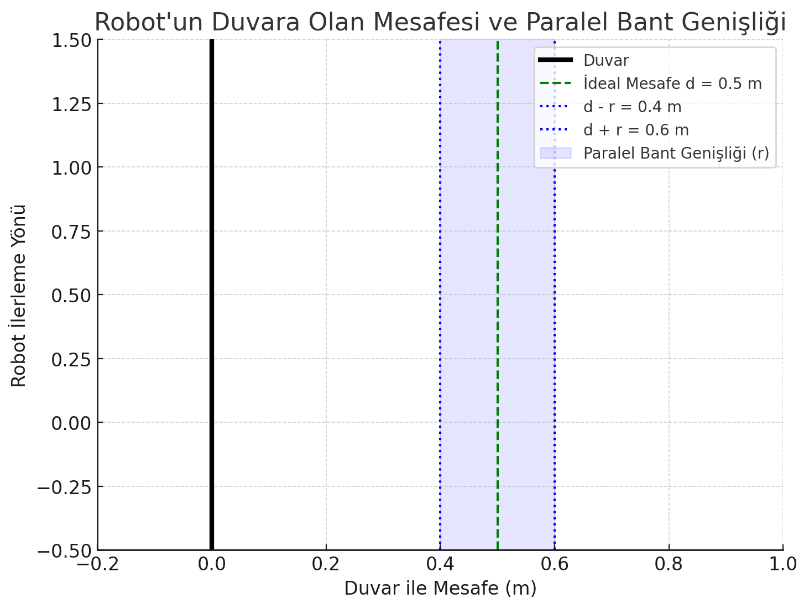
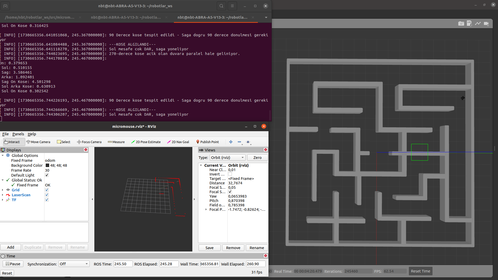
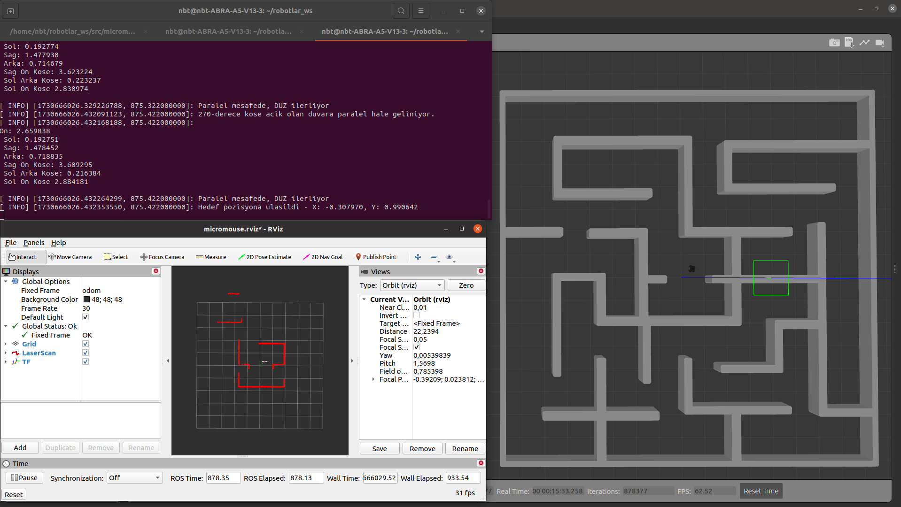
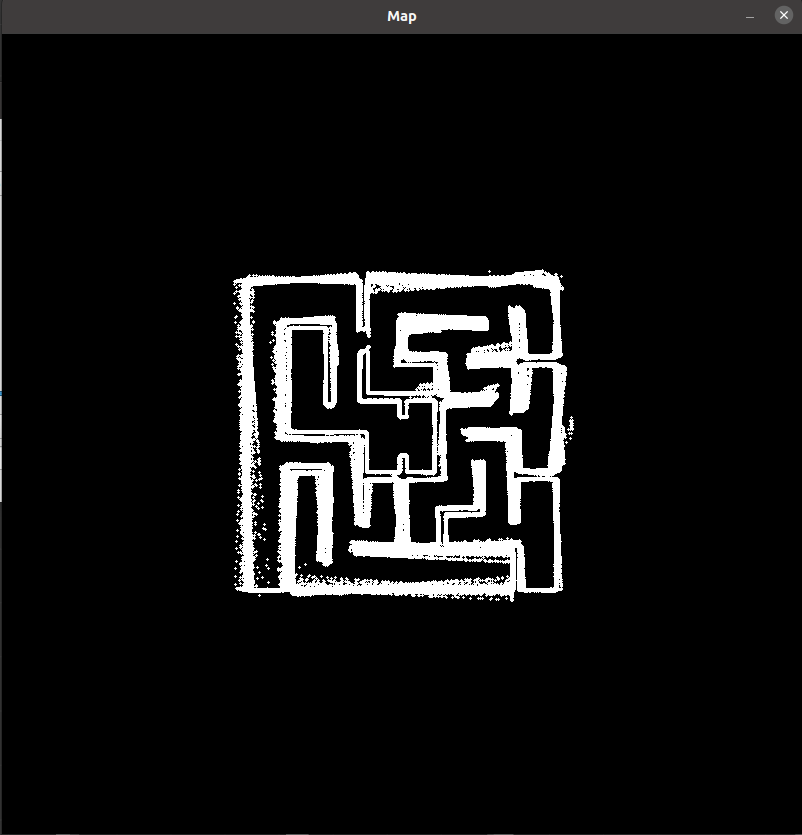
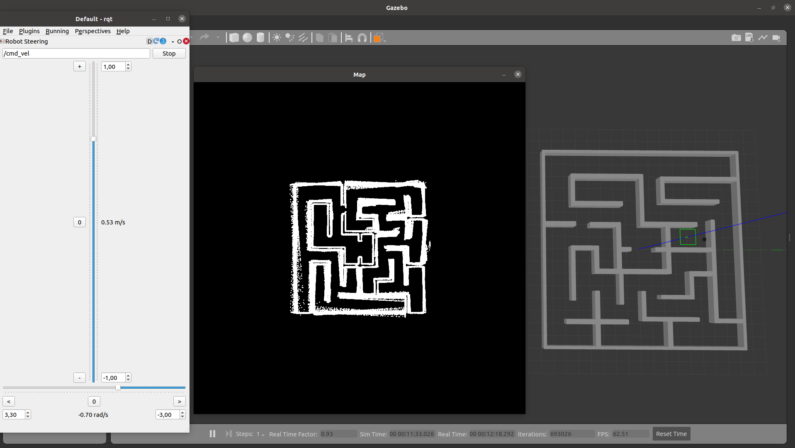

# Turtlebot3 Maze Solver and Mapper
## 📌 Project Description
This project aims to develop an autonomous system that combines the capabilities of the TurtleBot3 robot to solve mazes and map its environment using a LiDAR sensor (LaserScan), ROS (Robot Operating System) Noetic and OpenCV.
The project consists of two main components:
- Maze Solver → The robot tries to reach the maze exit by following the walls.
- Mapper → The robot creates a map of its environment in real time.
This system offers the ability to navigate by detecting obstacles and creating a digital map of the environment.

## 🔧 Technologies and Libraries Used
- LiDAR (LaserScan) Scanning the environment and calculating distances
- Odometry To track the position of the robot
- TF Transformations Coordinate transformations (base_scan → odom)
- OpenCV Real-time visualization of the map

## 🛠️ Working Logic of the Project
The project has two main components:

- Maze Solving Mechanism (Maze Solver)

Detects surrounding walls with LiDAR scanning.
Detects obstacles and changes direction.
It recognizes 90° and 270° corners and provides orientation.
Determines a safe path by moving parallel to the wall.
Terminates the movement when the destination is reached.

- Map Creation Mechanism (Mapper)
  
Maps the environment around the robot using LiDAR sensor.
Continuously updates the robot's position with TF transformations.
Plots the scanned points on the map in real time using OpenCV.
The map is continuously updated to show the area explored by the robot.

## 🚀Robot's Decision Mechanism

1️⃣ Sensor Data Processing

Distances are calculated with LiDAR scanning.
Obstacles and open areas are detected.
Incorrect or erroneous data is filtered out.

2️⃣ Navigation

The robot moves parallel to the wall.
If it detects obstacles in front of it, it changes direction.
If it detects a 90° or 270° corner, it makes the appropriate turn.
It moves forward keeping the distance parallel to the wall.
If the wall is too close, it turns slightly to the right.
If the wall is too far away, it turns slightly to the left.
If everything is in order, it goes straight ahead.

3️⃣ Map Update

LiDAR data is processed and the area explored by the robot is drawn on the map.
The position of the robot is updated with odometry and TF transformations.
Detected obstacles are marked on the map.

4️⃣ Goal Reach Control

By controlling the odometry data, the robot reaches the target point.
When the target position is reached, the robot stops and the process ends.

## Installation
```
$ mkdir -p ~/tb3_maze_solver_and_mapper/src
$ cd ~/tb3_maze_solver_and_mapper/src
$ git clone https://github.com/bugrahanturk/Turtlebot3-Maze-Solver-and-Mapper.git
$ cd ..
$ catkin_make
$ source ~/.bashrc
$ echo "export TURTLEBOT3_MODEL=waffle" >> ~/.bashrc
$ source ~/.bashrc
$ echo "export GAZEBO_MODEL_PATH=${GAZEBO_MODEL_PATH}:~/tb3_maze_solver/src/" >> ~/.bashrc
$ source ~/.bashrc
```
### Start the Environment
```
$ roslaunch micromouse_maze micromouse_maze4.launch
```
### Run Solver
```
$ rosrun solve_maze my_solver
```
### Run Mapper
```
$ rosrun solve_maze my_mapper
```

## Results
### my_solver
- The robot is set to follow the maze walls in parallel from the left.
- The distance of the robot to the wall was set to **d = 0.5** and the Parallelband distance was set to **r = 0.1**.



- Initial Status Image of the robot:



- Image of the robot reaching the center:




### my_mapper
- Map view:



- Mapping image of the robot guided using rqt_gui from the Gazebo environment:


